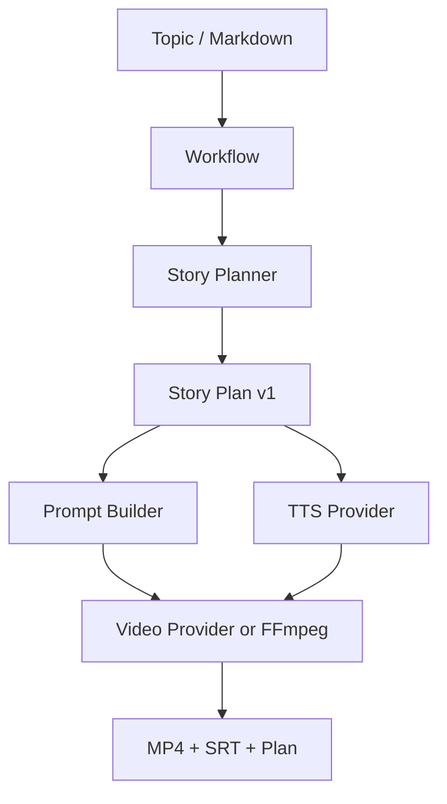

# Architecture

## Core data flow



## Boundaries

| Layer | Responsibility | Must not do |
|---|---|---|
| API | validate and queue a job | choose provider from user input |
| Workflow | compose planner, TTS and renderer | know vendor SDK details |
| Planner | produce versioned Story Plan | execute side effects or publish content |
| Provider adapter | translate one vendor contract | leak raw errors or secrets |
| Subtitle/FFmpeg | deterministic media assembly | infer business content |
| Storage | job state and artifacts | persist credentials or raw provider responses |

## Provider-neutral contract

The current `StoryPlan` is the handoff point shared by future workflows. A video provider can consume each shot's `prompt`, while local FFmpeg can render the same plan as a reviewable slideshow. This keeps the first release useful without pretending that a hosted video model is already configured.

## Runtime topology

The current local backend uses a filesystem queue with atomic state writes:

```text
FastAPI → .aivs/queue → atomic claim → .aivs/processing
                                      ↓
                         retry / lease recovery / artifacts
```

Each job has a durable record, an idempotency index, a processing lease and a
JSONL event stream. A worker crash leaves a lease that the next claimant can
recover. Phase 2 can replace only `FileJobStore` with Redis/Postgres-backed
storage; the API contract and workflow inputs should remain stable.

## Provider registry

The runtime registers active providers by capability (`llm`, `tts`, `video`).
The API exposes only provider IDs, capabilities and configured status. The
workflow receives concrete interfaces, while operators can inspect the active
runtime without learning or submitting vendor credentials.
