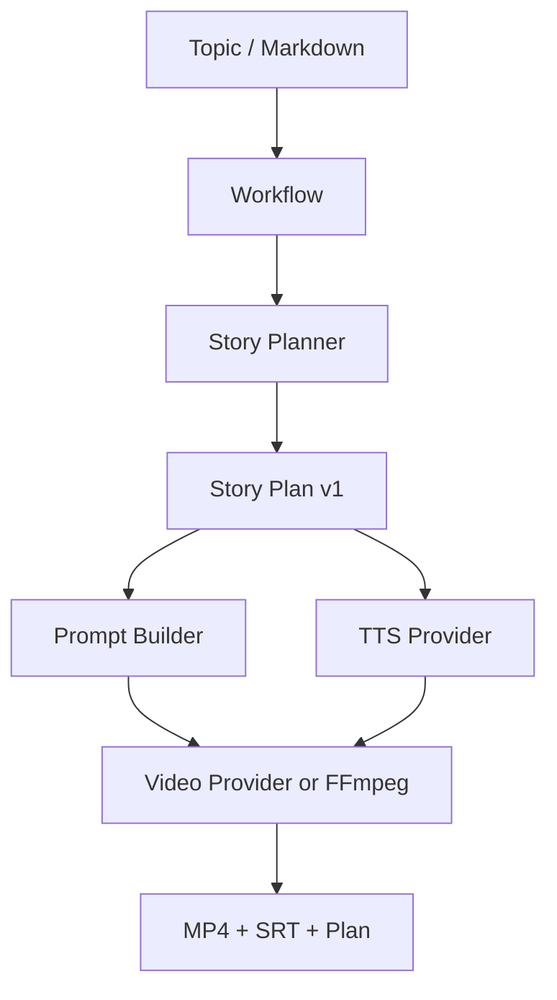

# Architecture

## Core data flow



## Boundaries

| Layer | Responsibility | Must not do |
|---|---|---|
| API | validate and queue a job | choose provider from user input |
| Workflow | compose planner, TTS and renderer | know vendor SDK details |
| Planner | produce versioned Story Plan | execute side effects or publish content |
| Provider adapter | translate one vendor contract | leak raw errors or secrets |
| Subtitle/FFmpeg | deterministic media assembly | infer business content |
| Storage | job state, catalogs, approvals, audit and generated artifacts | persist credentials or raw provider responses |

## Reusable content catalogs

`AssetCatalog` stores metadata and operator-imported files below the server-owned
library root. `CharacterCatalog` stores a stable character prompt, voice and
reference asset IDs. `TemplateCatalog` reads versioned JSON templates and
exposes only validated summaries and prompt fields to the workflow. A job may
reference these IDs, but it cannot submit a raw prompt override or local path.
Filesystem catalogs are the zero-dependency default; PostgreSQL mode can store
asset/character metadata while binary files remain server-owned.

## Provider-neutral contract

The current `StoryPlan` is the handoff point shared by future workflows. A
video provider consumes each shot's `prompt` independently (4–15 seconds),
while local FFmpeg can render the same plan as a reviewable slideshow. Provider
clips are concatenated and the narration is muxed once at the composition
boundary. This keeps the first release useful without pretending that a hosted
video model is already configured.

## Runtime topology

The default local backend uses a filesystem queue with atomic state writes:

```text
FastAPI → .aivs/queue → atomic claim → .aivs/processing
                                      ↓
                         retry / lease recovery / artifacts
```

Each job has a durable record, an idempotency index, a processing lease and a
JSONL event stream. A worker crash leaves a lease that the next claimant can
recover. The optional Redis backend keeps the same contract with a reliable
processing list, sorted-set retry schedule and Redis event/usage records:

```text
FastAPI → Redis queue → reliable processing list → worker
                              ↓ lease expiry
                       requeue / terminal failure
```

The API contract and workflow inputs remain stable when switching backends.
Redis shares queue metadata. `ArtifactStore` keeps a local staging boundary and
can publish generated files to S3/MinIO. PostgreSQL mode additionally shares
catalog metadata, approval history and publish audit events across API and
worker processes.

Every queue backend persists the same `JobProgress` contract. The workflow
reports planning, narration, shot generation and composition milestones; the
worker adds the social-draft milestone before the terminal success transition.
Progress is metadata, not a client-controlled command, and shot updates also
appear as safe `progress` events for operators and Agents.

The PostgreSQL backend uses the same metadata contract with transactional row
claims. It stores jobs, events, idempotency, usage, catalogs, approvals and
publish audit records; it does not store generated media or binary catalog
files.

With object storage enabled, the runtime boundary is:

```text
FastAPI → Redis queue → worker → local staging → S3/MinIO
     ↑                                      ↓
     └──── authenticated artifact stream ───┘
```

With PostgreSQL metadata, replace the queue segment with:

```text
FastAPI → PostgreSQL jobs → FOR UPDATE SKIP LOCKED → worker
```

## Provider registry

The runtime registers active providers by capability (`llm`, `tts`, `video`).
The API exposes only provider IDs, capabilities and configured status. The
workflow receives concrete interfaces, while operators can inspect the active
runtime without learning or submitting vendor credentials.

Server-side routing can select a provider by kind and required capabilities;
public job input still cannot name a provider. The built-in vendor directories
are transport-compatible scaffolds, not claims that a vendor's current API
contract, quota or credential flow has been verified.

## Publishing boundary

Social drafts are content artifacts, not publication receipts. The publishing
service evaluates the latest approval, records every preview/block/failure or
success in an audit store, and defaults to dry-run. A platform adapter is
registered server-side and is never selected by an agent's public payload.
